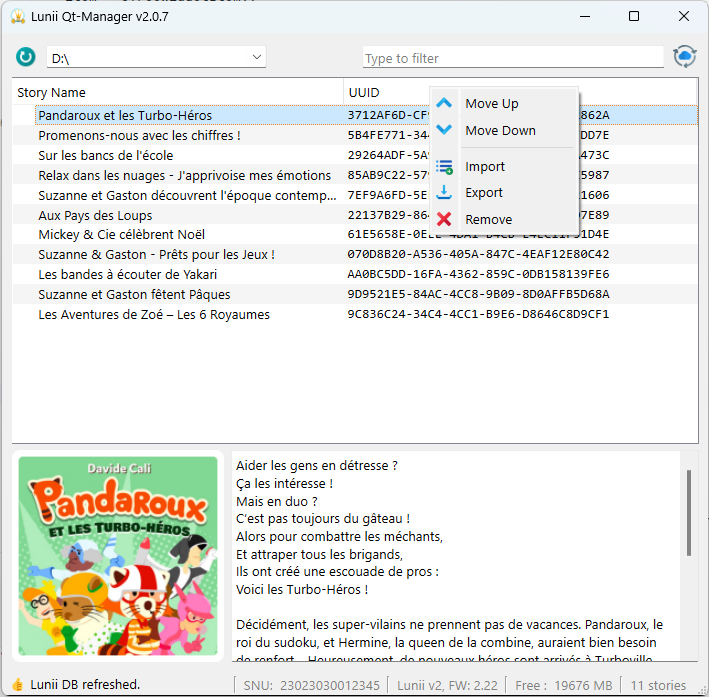

# Lunii.QT
A Python QT app to manage Lunii Storyteller



### TODO
* Create dedicated thread & slots to avoid interface freeze during import/export
* ~~support Linux / Mac (path entry)~~

## Shortcuts

| Keys       | Actions                        |
|------------|--------------------------------|
| "Alt+Up"   | Move the selected item(s) Up   |
| "Alt+Down" | Move the selected item(s) Down |
| "Delete"   | Remove the selected item(s)    |
| "Ctrl+S"   | Export the selection           |
| "Ctrl+I"   | Import new story               |
| "F5"       | Refresh devices                |


## Trick
### ICO creation
```bash
magick convert logo.png -define icon:auto-resize="256,128,96,64,48,32,16"  logo.ico
```
