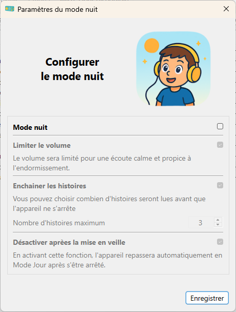
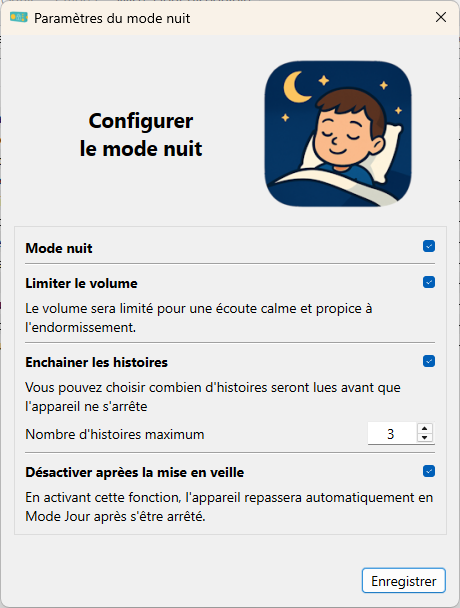

[](https://github.com/o-daneel/Lunii.QT/releases/tag/v3.1.0)
[](https://github.com/o-daneel/Lunii.QT/releases/tag/v3.0.0)
[](https://github.com/o-daneel/Lunii.QT/releases/tag/v2.7.6)

:uk: [English README](./README_EN.md) :uk:

# Lunii.QT

Une application Python QT pour gérer sa fabrique à histoires (fah) <u>Lunii</u> et <u>Flam</u>, avec les opérations de  **organisation** / **importation** / **exportation** / **téléchargement du firmware**   
pour Windows / Linux / MacOs 11  
(compatible avec les archives STUdio, **avec** support de la conversion audio)
> **FAQ :** Veuillez consulter les questions déjà posées dans la section [Discussions](https://github.com/o-daneel/Lunii.QT/discussions), ou les [Issues](https://github.com/o-daneel/Lunii.QT/issues?q=is%3Aissue%20label%3A%22good%20first%20issue%22) pertinentes.

# Nouveautés
*  😎 **Flam support** 😎  
L'application permet désormais d'importer les histoires Lunii sur votre Flam, sous réserve qu'elle soit en firmware v2.x.x  
    > **Attention :** la Flam est TRES lente en usb. Il faut etre patient. (environ 4min pour 80Mo)

* 😎 **Lunii v3 & Firmware 3.2.x** 😎  
Lunii.QT a été mis à jour pour prendre en charge le dernier firmware (3.2.2 et suivants). Grâce à une analyse approfondie (j’aurais dû connecter les neurones et réfléchir 10 minutes de plus à la premère analyse), une solution **stable** et **TRÈS simple** a été trouvée.  
Oubliez toutes les anciennes manipulations concernant les fichiers .md et le firmware.
  > **Rappel :** Gardez précieusement vos fichiers firmware v3 (vous pourrez toujours rétrograder) et évitez les mises à jour automatiques.

### Matériels pris en charge :
* **Fah v1** et **v2** (support complet)
* **Fah v3** (fichiers md v6 et v7 supportés, sauvegardes personnelles uniquement)
* **Flam** (support complet, sauvegardes personnelles uniquement)

### Limitations :
* L'application <u>n'autorise plus</u> d'exporter les histoires officielles pour les Lunii, à cause du piratage.  
Les Flams <u>pourront</u> sauvegarder et restaurer leurs histoires mais ne fonctionneront que sur le device d'origine.
* Le transcodage audio nécessite la présence de [FFMPEG](#vérification)


### Table des matières
<!-- TOC -->
- [Lunii.QT](#luniiqt)
  - [Interface Utilisateur](#interface-utilisateur)
    - [Fenêtre principale](#fenêtre-principale)
    - [Mode Nuit](#mode-nuit)
  - [Raccourcis clavier](#raccourcis-clavier)
  - [Fonctionnalités](#fonctionnalités)
  - [Transcodage audio](#transcodage-audio)
  - [Mise à jour du firmware](#mise-à-jour-du-firmware)
  - [Formats d'archives pris en charge](#formats-darchives-pris-en-charge)
    - [for Lunii](#for-lunii)
    - [for Flam](#for-flam)
  - [Python ? Guide Pratique](#python--guide-pratique)
    - [Préparation de l'environnement](#préparation-de-lenvironnement)
    - [Génération des UI](#génération-des-ui)
    - [Exécution](#exécution)
    - [Générer un exécutable GUI](#générer-un-exécutable-gui)
  - [Astuces](#astuces)
    - [macOS - Authorisation de l'application](#macos---authorisation-de-lapplication)
    - [Métadonnées des histoires non-officielles](#métadonnées-des-histoires-non-officielles)
    - [Gestion du cache](#gestion-du-cache)
    - [Dépendances manquantes sous Linux](#dépendances-manquantes-sous-linux)
    - [Exportation V3](#exportation-v3)
    - [Création de l'ICO](#création-de-lico)
  - [Remerciements](#remerciements)
- [Liens / Dépôts similaires](#liens--dépôts-similaires)
<!-- TOC -->

## Interface Utilisateur

<br> 

<br>  
<br>  
 

### Fenêtre principale

  

1. La **barre de menu**. Elle vous informera lorsqu'une mise à jour de l'application est disponible  
   (il suffit d'aller dans Menu About/Update to v2.X.X)
2. **L'emplacement de votre Lunii/Flam** lorsqu'elle est connectée.   
   Le bouton à gauche relance la détection automatique.
3. Gestion du **Mode nuit** ([ici](#mode-nuit))
4. Actualisation de la **base de données Officielle** : Met à jour la liste des histoires et leurs descriptions depuis le Luniistore. Utilisez ce bouton lorsque certaines histoires officielles ne sont pas reconnues.
5. La **liste de vos histoires** avec l'UUID et le type d'histoire (DB).  
   L'UUID : Un identifiant unique permettant de lier les histoires à leur dossier sur la Lunii/Flam. Les huit derniers caractères de l'UUID composent le nom du dossier de l'histoire.

   **DB** signifie **Base de données**. Cette application prend en charge deux bases de données différentes
     - **O** - Base de données **O**fficielle de Lunii  
        (Toutes les métadonnées proviennent des serveurs de Lunii).
     - **T** - base de données **T**ierce, également connue sous Non officielles ou Custom  
        (Ces métadonnées ne peuvent pas être récupérées, elles sont complétées lors de l'importation de l'histoire)
6. L'icône 🛏️ indique que **l'histoire supporte le Mode Nuit**. Il est possible de forcer ce status depuis le menu contextuel
7. **Histoires cachées** (les entrées grisées dans la liste).   
   Cette fonctionnalité est activable par le biais du menu contextuel sur une histoire.  
   Son usage est double:  
   1. Masquer certaines histoires pour éviter que l'enfant ne passe trop de temps à sélectionner une histoire le soir. Cela évite de la supprimer et la recopier de nouveau.  
   2. Eviter la suppresion d'histoires non officielles pendant une synchronisation avec l'application Luniistore. Les histoires cachées sont toujours physiquement présente dans l'appareil, mais ne seront pas visible par Luniistore. N'oubliez pas de bien "cacher" vos histoires avant de cliquer sur "synchroniser" !
8. Dans la **barre d'état**, vous trouverez  
   * Votre SNU (numéro de série),
   * La version du firmware de votre Lunii/Flam
   * L'espace disponible sur la SD
   * Le nombre d'histoires


### Mode Nuit
  

## Raccourcis clavier

| Keys           | Actions                                             |
|----------------|-----------------------------------------------------|
| `Ctrl+Up`      | Déplace la ou les sélection(s) en première position |
| `Alt+Up`       | Déplace la ou les sélection(s) vers le haut         |
| `Alt+Down`     | Déplace la ou les sélection(s) vers le bas          |
| `Ctrl+Down`    | Déplace la ou les sélection(s) en dernière position |
|                |                                                     |
| `Ctrl+I`       | Importe une nouvelle histoire                       |
| `Ctrl+S`       | Exporte la sélection                                |
| `Ctrl+Shift+S` | Exporte toutes les histoires                        |
| `Ctrl+H`       | Masquer/Démasquer les histoires sélectionnées       |
| `Ctrl+N`       | Forcer le mode nuit d'une histoire                  |
| `Delete`       | Supprime les histoires sélectionnées                |
|                |                                                     |
| `Ctrl+O`       | Ouvre le dossier d'une Lunii/Flamm                  |
| `Ctrl+L`       | Ouvre la fenêtre de debug                           |
| `Ctrl+Q`       | Fermer l'application                                |
| `F1`           | À propos de l'application                           |
| `F5`           | Réactualise les appareils                           |

## Fonctionnalités
* Détection automatique des **Mises à jour**
* **Import** / **Export** / **Suppression** des histoires
* Support des archives au format **STUdio**, et **importez la base d'histoire de STUdio**
* **Réorganisez** vos histoires dans votre ordre préféré
* Gérer le **mode nuit**
* **Cachez** les histoires  
  Dans le but de ne pas subir une suppression forcée des histoires non officielles durant la synchronisation avec l'application Luniistore, vous pouvez désormais "cacher" temporairement certaines histoires  
  (tous les fichiers sont conservés sur l'appareil)
* **Histoires perdues**  
  Trois nouveaux outils sont proposés pour gérer vos histoires perdues.   
  (souvent suite à un crash d'une autre application 😜)   
 
  Vous pouvez :
  * les lister  
    _(l'application tentera de réparer les histoires, en particulier les fichiers sur les Lunii v1/v2)_
  * les récupérer (si elles sont saines)
  * les supprimer (**attention, les fichiers seront supprimés**)  
* **Récupération du Firmware** pour votre appareil (cf. [cette section](#mise-à-jour-du-firmware))
  
## Transcodage audio
Certaines histoires tierces utilisent des fichiers non MP3. Ils ne peuvent donc pas être installés tels quels sur Lunii. Cela nécessite une étape de **transcodage**. Ce processus supplémentaire est réalisé à l'aide de l'outil **FFMPEG** disponible [ici](https://github.com/eugeneware/ffmpeg-static/releases/latest )  
 

**ATTENTION** : le transcodage est <u>très long</u>, il faut être patient. C'est pourquoi vous devriez préférer le format [.plain.pk](#plainpk) qui utilise un format audio compatible.

### Installation
#### Windows

**NOTE :** Désormais, et par défaut, FFMPEG 6.1.1 sera inclus dans les éditions portables et MSI de l'application sous Windows  
  
Procedure:
1) récupérez votre version de ffmpeg [ici](https://www.gyan.dev/ffmpeg/builds/)
2) renommez là en `ffmpeg.exe`
3) copiez le fichier à côté de lunii-qt.exe   
    ```
    - 
     |- lunii-qt.exe
     |- ffmpeg.exe
    ```
4) redémarrez luni-qt

Méthode alternative (préférée):
1) ouvrir un terminal powershell
2) exécutez les commandes suivantes pour installer le Scoop Package manager  
    ```powershell
    Set-ExecutionPolicy -ExecutionPolicy RemoteSigned -Scope CurrentUser
    Invoke-RestMethod -Uri https://get.scoop.sh | Invoke-Expression
    ```
3) installez ffmpeg avec   
  `scoop install ffmpeg`
4) redémarrez luni-qt

#### Linux
1) ouvrir un terminal
2) exécutez la commande suivante :   
`sudo apt-get install ffmpeg`
4) redémarrez luni-qt

#### macOS
Afin de simplifier l'installation de ffmpeg, il est recommandé d'utiliser Bew, https://brew.sh/  
1) ouvrir un terminal
2) exécutez la commande suivante  
`/bin/bash -c "$(curl -fsSL https://raw.githubusercontent.com/Homebrew/install/HEAD/install.sh)"`
3) à la fin de l'installation, installez ffmpeg avec:  
`brew install ffmpeg`
4) redémarrez luni-qt

### Vérification 
Dans l'application, le menu `Tools` affiche l'état de la détection.
#### Non trouvé
  
#### Trouvé


## Mise à jour du firmware

Lunii.QT vous offre la possibilité de sauvegarder et de mettre à jour votre Firmware sans vous connecter au LuniiStore (vous ne perdrez pas vos histoires chargées non officielles). Cette procédure est **expérimentale** mais jusqu'à présent personne n'a rencontré de problèmes.

**NOTE 1:** Pensez à garder une sauvegarde de votre firmware pour Lunii v3 et FLAMs, dans le cas d'une mise à jour qui casserait l'astuce des histoires tierces. <u>Vous serez en mesure de rétrograder.</u>  
**NOTE 2:** Vous ne pouvez pas choisir la version du firmware. Vous n'obtiendrez que la **dernière version disponible** sur les serveurs de Lunii.


### Guide Pratique - Lunii
1. Sélectionnez une Lunii
2. Menu **Outils/Récupérer le firmware**
3. Vous serez invité à vous connecter  


4. Entrez vos identifiants Luniistore (ils ne sont pas sauvegardés pour des raisons de sécurité).  
   Vous pouvez vérifier ce point ici  
   https://github.com/o-daneel/Lunii.QT/blob/a8bd30e1864552687f235004085a417d7c6b00e6/pkg/main_window.py#L468-L475
5. Choisissez un emplacement où sauvegarder votre firmware (deux fichiers pour une Lunii v1)
6. Copiez-la dans le répertoire racine de votre lunii
7. Renommez-le en `fa.bin` (et aussi `fu.bin`  pour les Lunii v1)   
```
- 
 |- .contents
 |- .md
 |- .pi
 |- fa.bin
 |- ... (other files)
```
8. Éteindre, rallumer, attendre : **TADA**  
   (si vous reconnectez votre lunii sur votre pc, le `fa.bin` devrait avoir été supprimé)
   

### Guide Pratique - Flam
1. Sélectionnez votre Flam dans la liste des appareils
2. Menu **Outils/Récupérer le firmware**
3. Vous serez invité à vous connecter  


4. Entrez vos identifiants Luniistore (ils ne sont pas sauvegardés pour des raisons de sécurité).  
   Vous pouvez vérifier ce point ici  
   https://github.com/o-daneel/Lunii.QT/blob/a8bd30e1864552687f235004085a417d7c6b00e6/pkg/main_window.py#L468-L475
5. Choisissez un emplacement où sauvegarder vos firmwares (`update-main.enc` and `update-comm.enc`)
6. Copiez-les dans le répertoire racine de votre Flam    
```
- 
 |- etc/
 |- str/
 |- .mdf
 |- update-main.enc
 |- update-comm.enc
 |- ... (other files)
```
7. Créer un fichier vide `cable_update_complete` dans /tmp
```
- 
 |- etc/
 |- str/
 |- .mdf
 |- update-main.enc
 |- update-comm.enc
 |- tmp/
   |- cable_update_complete
 |- ... (other files)
```
8. Éteindre, rallumer, attendre : **TADA**  
   (si vous reconnectez votre lunii sur votre pc, les `*.enc` devraient avoir été supprimés)
   
## Formats d'archives pris en charge
### pour Lunii
#### .plain.pk
**Filename** :  `story_name.8B_UUID.plain.pk`  
**Ciphering** : None / Plain  
**Structure** :  

      _thumbnail.png
      _metadata.json
      uuid.bin
      ni
      li.plain
      ri.plain
      si.plain
      rf/000/XXYYXXYY.bmp
      sf/000/XXYYXXYY.mp3

#### .v1.pk / .v2.pk
**Filename** :  
* `LONG_UUID.v2.pk`  
* `LONG_UUID.v2.pk`  
* `LONG_UUID.pk`  
  
**Ciphering** : Generic Key  
**Structure** :  

      00000000000000000000000000000000/ni
      00000000000000000000000000000000/li
      00000000000000000000000000000000/ri
      00000000000000000000000000000000/si
      00000000000000000000000000000000/rf/000/XXYYXXYY
      00000000000000000000000000000000/sf/000/XXYYXXYY

#### ZIP (old Lunii.QT)
**Filename** :  `8B_UUID - story_name.zip`  
**Ciphering** : Generic Key  
**Structure** :  

      uuid.bin
      ni
      li
      ri
      si
      rf/000/XXYYXXYY
      sf/000/XXYYXXYY

#### ZIP (alternate)
**Filename** :  `AGE+] story_title DASHED_UUID.zip`  
**Ciphering** : Generic Key  
**Structure** : (same as [.v1.pk / .v2.pk](#v1pk--v2pk))

      00000000-0000-0000-0000-000000000000/ni
      00000000-0000-0000-0000-000000000000/li
      00000000-0000-0000-0000-000000000000/ri
      00000000-0000-0000-0000-000000000000/si
      00000000-0000-0000-0000-000000000000/rf/000/XXYYXXYY
      00000000-0000-0000-0000-000000000000/sf/000/XXYYXXYY

#### 7z
**Filename** : `AGE+] story_title DASHED_UUID.7z`  
**Ciphering** : Generic Key  
**Structure** :  

      00000000-0000-0000-0000-000000000000/ni
      00000000-0000-0000-0000-000000000000/li
      00000000-0000-0000-0000-000000000000/ri
      00000000-0000-0000-0000-000000000000/si
      00000000-0000-0000-0000-000000000000/rf/000/XXYYXXYY
      00000000-0000-0000-0000-000000000000/sf/000/XXYYXXYY

#### STUdio (ZIP / 7z)
**Filename** : `AGE+] story_title DASHED_UUID.zip .7z`  
**Ciphering** : None  

**Structure** :  

        assets/
        story.json
        thumbnail.png
      
### pour Flam
**NOTE :** Le format des histoires de la Flam reste inconnu. Seul les sauvegardes personnelles sont supportées
#### .zip
**Filename** :  `story_name.8B_UUID.zip`  
**Ciphering** : Story Key (unknown)  
**Structure** :  

      00000000-0000-0000-0000-000000000000/info
      00000000-0000-0000-0000-000000000000/main.lsf
      00000000-0000-0000-0000-000000000000/version
      00000000-0000-0000-0000-000000000000/key
      00000000-0000-0000-0000-000000000000/img/*.lif
      00000000-0000-0000-0000-000000000000/img/script/*.lif
      00000000-0000-0000-0000-000000000000/script/*.lsf
      00000000-0000-0000-0000-000000000000/sounds/*.mp3
      00000000-0000-0000-0000-000000000000/sounds/*.mp3map

## TODO
* Fichier de configuration pour sauvegarder la configuration du menu (tailles / détails)
* Ajout d'une image à la liste des arbres ?

## Python ? Guide Pratique

### Préparation de l'environnement

Commencer par cloner le dépot.  
Préparer l'environnement virtuel pour le projet et installer les dépendances.
```bash
$ python3 -m venv venv
```

Passez à votre venv
* sous Linux   
   `source venv/bin/activate`
* sous Windows   
  `.\venv\Scripts\activate.bat`

Installer les dépendances
```
$ pip install -r requirements.txt
```

**Linux** a besoin d'une dépendance supplémentaire.

```bash
$ apt install libxcb-cursor0
```
### Génération des UI
```bash
$ pyside6-uic pkg/ui/main.ui -o pkg/ui/main_ui.py
$ pyside6-uic pkg/ui/nm.ui   -o pkg/ui/nm_ui.py
```
### Génération des fichiers de tranduction
```bash
$ pyside6-lupdate ./pkg/ui/main.ui ./pkg/ui/nm.ui ./pkg/ui/about_ui.py ./pkg/ui/debug_ui.py ./pkg/ui/login_ui.py ./pkg/nm_window.py ./pkg/main_window.py ./pkg/ierWorker.py ./pkg/versionWorker.py ./pkg/api/devices.py ./pkg/api/device_flam.py ./pkg/api/device_lunii.py -ts ./locales/fr_FR.ts
$ pyside6-linguist ./locales/fr_FR.ts  # optionnaly, update translations
$ pyside6-lrelease ./locales/fr_FR.ts ./locales/fr_FR.qm  
```
### Génération du fichier de ressource
```bash
$ pyside6-rcc resources.qrc -o resources_rc.py
```
### Exécution
```bash
$ python lunii-qt.py
```

### Générer un exécutable GUI
**NOTE :** PyInstaller by its design generates executables that are flagged by AntiViruses. Those are false positives. cx_Freeze is an alternative that allows to avoid such false positives.

#### PyInstaller 👎
```bash
$ pip install pyinstaller
$ pyinstaller lunii-qt.spec
...
$ dist\lunii-qt
```

#### cx_Freeze 👍
```bash
$ pip install cx_Freeze
$ python setup.py build_exe
...
$ build/exe.win-amd64/lunii-qt
```

## Astuces

### macOS - Authorisation de l'application
1. Double cliquez sur le fichier `lunii-qt`.
2. Vous devez voir apparaître le message d'erreur suivant :     
  
  Cliquez sur "**OK**"
3. Allez dans **Préférences du système** > **Sécurité et confidentialité** et cliquez sur l'onglet **Général**.  

4. En bas de la fenêtre, vous trouverez un message indiquant que  `lunii-qt` est bloqué. Cliquez sur "**Ouvrir quand même**".   
   Si vous ne voyez pas ce message sur l'onglet Général, double cliquez de nouveau sur `lunii-qt`.  
   **NOTE :** Il est possible que vous deviez en premier cliquer sur le bouton "**unlock**" puis entrer votre nom d'utilisateur / mot de passe pour pouvoir cliquer sur "**Ouvrir quand même**".
5. Une nouvelle popup apparait       
  
Cliquez sur "**Ouvrir**".   
Si vous n'avez pas eu cette popup, retournez juste double cliquer sur le fichier.
1. Pour finir, un dernier message vous informera de la sorte       
  
Cliquez sur "**Ouvrir**", et vous n'aurez plus ces avertissements à l'avenir. 

### Métadonnées des histoires non-officielles
Lors de l'utilisation de cette application, vous allez peut-être constater des hisoires marquées `Unknown story (maybe a User created story)...`. 
Il s'agit certainement d'une histoire tierce qui a été chargé par une autre application. Lunii.QT n'a donc 
pas connaissance des métadonnées associées (Titre, Description, Image).  
Il est possible de pallier ce problème de deux manières (au choix) :
1. en important la base d'histoires de STUdio avec le menu `File/Import STUdio DB`
2. en glissant déposant l'archive de l'histoire dans l'application, comme pour la charger. Cette dernière étant déjà présente, Lunii.Qt ne va faire qu'**analyser les métadonnées** et les ajouter dans la base interne, en prenant soin de **ne pas recharger** l'histoire.

### Gestion du cache
Cette application téléchargera une fois pour toutes la base de données des histoires officielles et toutes les images demandées dans le dossier dédié à l'application.
* `$HOME/.lunii-qt/official.db`
* `$HOME/.lunii-qt/cache/*`

En cas de problème, il suffit de supprimer ce fichier et ce répertoire pour forcer le rafraîchissement.


### Dépendances manquantes sous Linux
Si vous rencontrez l’erreur suivante lors du lancement de Lunii.QT sous Linux :

```
qt.qpa.plugin: Could not load the Qt platform plugin "xcb" in "" even though it was found.
This application failed to start because no Qt platform plugin could be initialized. Reinstalling the application may fix this problem.

Available platform plugins are: offscreen, vkkhrdisplay, xcb, minimalegl, vnc, eglfs, minimal, linuxfb, wayland-egl, wayland.
```

Cela signifie qu’une bibliothèque système requise pour l’interface graphique Qt est manquante.

**Solution :**  
Installez la dépendance manquante en exécutant la commande suivante dans votre terminal :

```bash
sudo apt install libxcb-cursor0
```

Après l’installation, essayez de relancer Lunii.QT.  
Si le problème persiste, assurez-vous que toutes les autres dépendances Qt sont installées.


### Exportation V3
Afin de supporter l'exportation d'histoires depuis une Luniis v3, vous devez placer vos clés de périphérique ici :
```bash
%HOME%\.lunii-qt\230230300XXXXX.keys
$HOME/.lunii-qt/230230300XXXXX.keys
```
Il s'agit d'un fichier binaire avec 0x10 octets pour la clé et 0x10 octets pour l'IV.

### Création de l'ICO
```bash
magick convert logo.png -define icon:auto-resize="256,128,96,64,48,32,16"  logo.ico
```

## Remerciements
Merci à :
* **olup** pour l'aide sur le format des archives STUdio  
* **sniperflo** pour le support de la v1 & debug 
* **McFlyPartages** pour le debug sous Linux et ses contributions 
*  ceux que j'oublie.... 👍

# Liens / Dépôts similaires
* [Lunii v3 - Reverse Engineering](https://github.com/o-daneel/Lunii_v3.RE)
* [Lunii CLI tool](https://github.com/o-daneel/Lunii.PACKS)
* [STUdio - Story Teller Unleashed](https://marian-m12l.github.io/studio-website/)
* [(GitHub) STUdio, Story Teller Unleashed](https://github.com/marian-m12l/studio)
* [Lunii Admin](https://github.com/olup/lunii-admin) (Une alternative en Go de STUdio)
* [Lunii Admin Web](https://github.com/olup/lunii-admin-web) (même chose que précédemment, mais à partir d'un navigateur)
* Astuce de l'icone dans le workflow avec  **[rcedit](https://github.com/electron/rcedit)**
