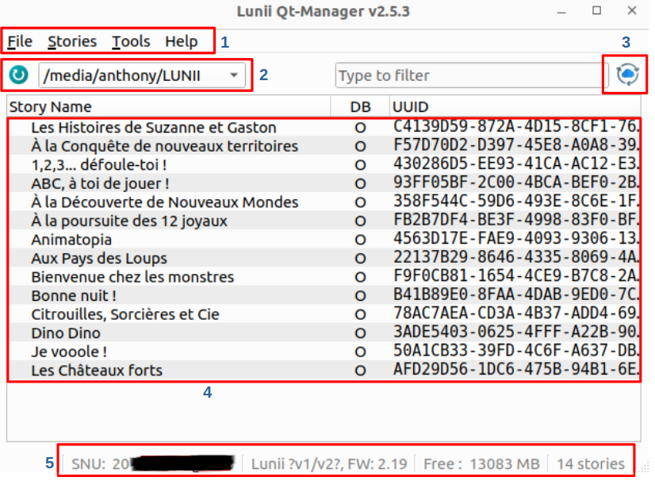

:fr: [README en français](./README_FR.md) :fr:

# Lunii.QT

This is an application, written in Python QT, compatible with Linux, Windows and Mac OS 11, for managing your Lunii Storyteller devices.

It allows you to reorganize, import and export your stories, as well as download and install the latest firmware **#####Choose firmware or only the latest ?#####**.

**Supported hardware:**
* My Story Factory V1 and V2 (full support)
* My Story Factory V3 (export requires device key file)

**Limitations:**
* The application can no longer export official stories.
* Audio transcoding requires the presence of [FFMPEG V6](#check)
* FLAM" is not yet supported (*work in progress*)

**To do**
* Add FLAM support ?
* Improve 7z archive processing
* Configuration file to save menu settings (sizes / details)
* Add image to tree list?


### Table of contents
<!-- TOC -->
- [Lunii.QT](#luniiqt)
  - [Interface presentation](#interface-presentation)
  - [Shortcuts](#shortcuts)
  - [Installations](#installations)
    - [Linux](#linux)
    - [Windows](#windows)
  - [Audio transcoding](#audio-transcoding)
  - [Tips](#tips)
  - [Build your applications](#build-your-applications)
  - [Supported archive formats](#supported-archive-formats)
  - [Credits](#credits)
- [Links / Similar repositories](#links--similar-repositories)
<!-- TOC -->

## Interface presentation


This is the Luni QT interface.
1. The menu bar.
1. The location of your Lunii when it's connected. The button on the left updates automatic detection.
1. Updates the list of stories and related information from the official Lunii Store.
1. The list of your stories with UUID and Database (DB) origin. 
    1. The UUID: This unique identifier allows you to associate stories with their folder on the Lunii, thanks to the last eight characters that make up the name of the folder associated with that story.
    1. DB: There are two databases supported: `O` for the official Lunii database (all metadata comes from Lunii servers) and `T` for the third-party database also known as Unofficial or Custom Stories (this metadata cannot be retrieved, it is filled in when the story is imported).
1. In this status bar, you'll find your SNU (serial number), the firmware version of your Lunii, the available space and the number of stories it contains.

More screenshots :


### Shortcuts

| Keys           | Actions                          |
|----------------|----------------------------------|
| `Ctrl+Up`      | Move the selected item(s) Top    |
| `Alt+Up`       | Move the selected item(s) Up     |
| `Alt+Down`     | Move the selected item(s) Down   |
| `Ctrl+Down`    | Move the selected item(s) Bottom |
|                |                                  |
| `Ctrl+I`       | Import new story                 |
| `Ctrl+S`       | Export the selection             |
| `Ctrl+Shift+S` | Export all the stories           |
| `Delete`       | Remove the selected item(s)      |
|                |                                  |
| `Ctrl+O`       | Open a Lunii device              |
| `Ctrl+L`       | Open debug log window            |
| `F1`           | About the app                    |
| `F5`           | Refresh devices                  |


## Installations
### Linux
Check the version of Python installed on your machine with the command `python3 -V`.

```bash
anthony@McFly-Bureau:~$ python3 -V
Python 3.10.12
```

If you don't have Python installed, run the following command.

```bash
sudo apt install python3
```

**Install dependencies
bash
sudo apt install libxcb-cursor0
```

Download the [latest version of Luni.QT for Linux](https://github.com/o-daneel/Lunii.QT/releases) and unzip it.

Double-click on `lunii-qt` to launch the application.

#### Debugging
If you encounter any problems during launch, try running the application from the Terminal in the folder with the following command. It should display an error message that you'll need to troubleshoot.

bash
./lunii-qt
```

### Windows
>FALSE POSITIVE: Your operating system (and VirusTotal too) might report the executable as a threat, but it's not. It's a false positive due to pyinstaller. Binaries are generated by workflows from GitHub, directly from Sources to Binary.
>Never trust an executable on the internet, and [rebuild it yourself](#build-your-applications) (you'll get the same result 😅).

Get the [latest version of Luni.QT for Linux](https://github.com/o-daneel/Lunii.QT/releases) then unzip it.

Double-click on `lunii-qt.exe` to launch the application.

## Audio transcoding
Some third-party stories use non-MP3 files. They cannot be installed on Lunii as they are. This requires a **transcoding** step. This additional process is carried out using the **FFMPEG** tool available [here](https://github.com/eugeneware/ffmpeg-static/releases/latest ):     
 

**WARNING**: transcoding is **very time-consuming**, so you need to be patient. This is why you should prefer the [.plain.pk](#plainpk) format, which uses compatible sound.

### Installation
Make sure you have the `ffmpeg` command in your path.  
If you're lost, you can grab a standalone binary from the previous link, for your platform (Win/Linux/MacOs), and copy it next to this application, like this:

```tree
- 
 |- lunii-qt.exe
 |- ffmpeg.exe
```

1) Get your version of ffmpeg
2) Rename it to `ffmpeg.exe` or `ffmpeg` (depending on your operating system)
3) Copy next to `lunii-qt.exe` or `lunii-qt` (depending on your operating system)

### Check 
In the application, the Tools menu displays the detection status.
#### Not found
FFMPEG Not available](res/ffmpeg_off.png)  
#### Found


## Tips
### Cache management
This application will download once and for all the official stories database and all the images requested in the folder dedicated to the application.
* `$HOME/.lunii-qt/official.db`
* `$HOME/.lunii-qt/cache/*`

In the event of a problem, simply delete this file and directory to force a refresh.

### Export V3
To support story export from Lunii v3 hardware, you need to place your device keys here:
```bash
%HOME%\.lunii-qt\v3.keys
$HOME/.lunii-qt/v3.keys
```
This is a binary file with 0x10 bytes for the key and 0x10 bytes for the IV.

### ICO creation
```bash
magick
```

## Build your applications

**Preparing the environment

Start by cloning the repository.
Prepare the virtual environment for the project and install dependencies.
bash
python -m venv venv
```

Switch to your venv
* under Linux   
   source venv/bin/activate`
* under Windows   
  `.\venv\Scripts\activate.bat`

Install dependencies
```
pip install -r requirements.txt
```

**Linux** needs an additional dependency.

```bash
apt install libxcb-cursor0
```
**Build UI file
```bash
$ pyside6-uic pkg/ui/main.ui -o pkg/ui/main_ui.py
$ pyside6-rcc resources.qrc -o resources_rc.py
```
**Start**
```bash
python lunii-qt.py
```

**Build executable**
```bash
pip install pyinstaller
pyinstaller lunii-qt.spec
...
dist\lunii-qt
```


## Supported archive formats
### .plain.pk
**Filename** :  `story_name.8B_UUID.plain.pk`  
**Ciphering** : None / Plain  
**Structure** :  

      uuid.bin
      ni
      li.plain
      ri.plain
      si.plain
      rf/000/XXYYXXYY.bmp
      sf/000/XXYYXXYY.mp3
### .v1.pk / .v2.pk
**Filename** :  
* `LONG_UUID.v2.pk`  
* `LONG_UUID.v2.pk`  
* `LONG_UUID.pk`  
  
**Ciphering** : Generic Key  
**Structure** :  

      00000000000000000000000000000000/ni
      00000000000000000000000000000000/li
      00000000000000000000000000000000/ri
      00000000000000000000000000000000/si
      00000000000000000000000000000000/rf/000/XXYYXXYY
      00000000000000000000000000000000/sf/000/XXYYXXYY
### ZIP (old Lunii.QT)
**Filename** :  `8B_UUID - story_name.zip`  
**Ciphering** : Generic Key  
**Structure** :  

      uuid.bin
      ni
      li
      ri
      si
      rf/000/XXYYXXYY
      sf/000/XXYYXXYY

### ZIP (alternate)
**Filename** :  `AGE+] story_title DASHED_UUID.zip`  
**Ciphering** : Generic Key  
**Structure** : (same as [.v1.pk / .v2.pk](#v1pk--v2pk))

      00000000-0000-0000-0000-000000000000/ni
      00000000-0000-0000-0000-000000000000/li
      00000000-0000-0000-0000-000000000000/ri
      00000000-0000-0000-0000-000000000000/si
      00000000-0000-0000-0000-000000000000/rf/000/XXYYXXYY
      00000000-0000-0000-0000-000000000000/sf/000/XXYYXXYY

### 7z
**Filename** : `AGE+] story_title DASHED_UUID.7z`  
**Ciphering** : Generic Key  
**Structure** :  

      00000000-0000-0000-0000-000000000000/ni
      00000000-0000-0000-0000-000000000000/li
      00000000-0000-0000-0000-000000000000/ri
      00000000-0000-0000-0000-000000000000/si
      00000000-0000-0000-0000-000000000000/rf/000/XXYYXXYY
      00000000-0000-0000-0000-000000000000/sf/000/XXYYXXYY

### STUdio (ZIP / 7z)
**Filename** : `AGE+] story_title DASHED_UUID.zip .7z`  
**Ciphering** : None  

**Structure** :  

        assets/
        stroy.json
        thumbnail.png


## Credits
Thanks to :
**olup** for the STUdio archives
**sniperflo** for V1 support and debugging

# Links / Similar repositories
* Lunii v3 - Reverse Engineering](https://github.com/o-daneel/Lunii_v3.RE)
* [STUdio - Story Teller Unleashed](https://marian-m12l.github.io/studio-website/)
* [(GitHub) STUdio, Story Teller Unleashed](https://github.com/marian-m12l/studio)
* [Lunii Admin](https://github.com/olup/lunii-admin) (An enGo alternative to STUdio)
* [Lunii Admin Web](https://github.com/olup/lunii-admin) (same as above, but browser-based)