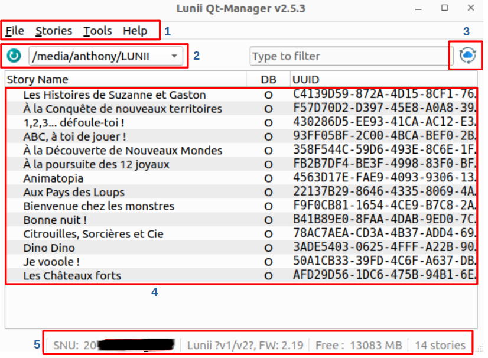

:uk: [Readme in English](./README.md) :uk:

# Lunii.QT

C'est une application, écrite en Python QT, compatible Linux, Windows et Mac OS 11, permettant la gestion de vos appareils Lunii Storyteller.

Elle permet de réorganiser, importer, exporter vos histoires, mais aussi de télécharger et installer le dernier firmware **#####Choix du firmware ou seulement le dernier ?#####**.

**Matériels pris en charge :**
* Ma fabrique à histoire V1 et V2 (support complet)
* Ma fabrique à histoire V3 (l'exportation nécessite un fichier clé de l'appareil)

**Limitations :**
* L'application ne permet plus d'exporter les histoires officielles.
* Le transcodage audio nécessite la présence de [FFMPEG V6](#vérification)
* La "FLAM" n'est pas encore supportée (*travail en cours*)

**À faire**
* Ajouter le support de la FLAM ?
* Améliorer le traitement des archives 7z
* Fichier de configuration pour sauvegarder la configuration du menu (tailles / détails)
* Ajout d'une image à la liste des arbres ?


### Table des matières
<!-- TOC -->
- [Lunii.QT](#luniiqt)
  - [Présentation de l'interface](#présentation-de-linterface)
  - [Raccourcis clavier](#racourcis-clavier)
  - [Installations](#installations)
    - [Linux](#linux)
    - [Windows](#windows)
  - [Transcodage audio](#transcodage-audio)
  - [Astuces](#astuces)
  - [Construisez vos applications](#construisez-vos-applications)
  - [Formats d'archives pris en charge](#formats-darchives-pris-en-charge)
  - [Crédits](#crédits)
- [Liens / Dépôts similaires](#liens--dépôts-similaires)
<!-- TOC -->

## Présentation de l'interface


Voici l'interface de Luni QT.
1. La barre de menu.
1. L'emplacement de votre Lunii quand elle est connectée, le bouton à gauche permet d'actualiser la détection automatique.
1. Permet la mise à jour de la liste des histoires ainsi que les informations associées depuis le Lunii Store officiel.
1. La liste de vos histoires avec l' UUID et l'origine de la Base de donnée (DB). 
    1. L'UUID : Cet identifiant unique vous permet d'associer les histoires avec leur dossier sur la Lunii grâce aux huit derniers caractères qui forment le nom du dossier associé à cette histoire.
    1. DB : Il y a deux bases de données prises en charge. `O` pour la base de données officielle de Lunii (toutes les métadonnées proviennent des serveurs Lunii) et `T` pour la base de données tierce également connu sous le nom d'Histoires non officielles ou personnalisées (Ces métadonnées ne peuvent pas être récupérées, elles sont complétées lors de l'importation de l'histoire).
1. Dans cette barre d'état, vous retrouverez votre SNU (numéro de série), la version du firmware de votre Lunii, l'espace disponible et le nombre d'histoires qu'elle contient.

D'autres captures :


### Raccourcis clavier

| Keys           | Actions                                               |
|----------------|-------------------------------------------------------|
| `Ctrl+Up`      | Déplace la ou les sélection(s) en première position   |
| `Alt+Up`       | Déplace la ou les sélection(s) vers le haut           |
| `Alt+Down`     | Déplace la ou les sélection(s) vers le bas            |
| `Ctrl+Down`    | Déplace la ou les sélection(s) en dernière position   |
|                |                                                       |
| `Ctrl+I`       | Importe une nouvelle histoire                         |
| `Ctrl+S`       | Exporte la sélection                                  |
| `Ctrl+Shift+S` | Exporte toutes les histoires                          |
| `Delete`       | Supprime les histoires sélectionnées                  |
|                |                                                       |
| `Ctrl+O`       | Ouvre le dossier de votre Lunii                       |
| `Ctrl+L`       | Ouvre la fenêtre de debug                             |
| `F1`           | À propos de l'application                              |
| `F5`           | Réactualise les appareils                              |


## Installations
### Linux
Vérifier la version de Python installée sur votre machine avec la commande `python3 -V`.

```bash
anthony@McFly-Bureau:~$ python3 -V
Python 3.10.12
```

Si vous n'avez pas Python installé, lancez la commande suivante.

```bash
sudo apt install python3
```

**Installer les dépendances**
```bash
sudo apt install libxcb-cursor0
```

Récupérez la [dernière version de Luni.QT pour Linux](https://github.com/o-daneel/Lunii.QT/releases) puis décompressez-la.

Double-cliquer sur `lunii-qt` pour lancer l'application.

#### Débug
En cas de problème lors du lancement, essayez d'exécuter l'application depuis le Terminal dans le dossier avec la commande suivante. Il devrait vous afficher un message d'erreur qu'il faudra dans une issue.

```bash
./lunii-qt
```

### Windows
>FAUX POSITIF : Votre système d'exploitation (et VirusTotal également) pourrait signaler l'executable comme une menace, mais ce n'est pas le cas. C'est un faux positif dû à pyinstaller. Les binaires sont générés par des workflows depuis GitHub, directement de Sources à Binaire.
>Ne faites jamais confiance à un exécutable sur internet, et [reconstruisez-le vous-même](#construisez-vos-applications) (vous arriverez au même résultat 😅).

Récupérez la [dernière version de Luni.QT pour Linux](https://github.com/o-daneel/Lunii.QT/releases) puis décompressez-la.

Double-cliquer sur `lunii-qt.exe` pour lancer l'application.

## Transcodage audio
Certaines histoires tierces utilisent des fichiers non MP3. Ils ne peuvent donc pas être installés tels quels sur Lunii. Cela nécessite une étape de **transcodage**. Ce processus supplémentaire est réalisé à l'aide de l'outil **FFMPEG** disponible [ici](https://github.com/eugeneware/ffmpeg-static/releases/latest ) :     
 

**ATTENTION** : le transcodage est **très long**, il faut être patient. C'est pourquoi vous devriez préférer le format [.plain.pk](#plainpk) qui utilise un son compatible.

### Installation
Vous devez vous assurer que la commande `ffmpeg` se trouve dans votre chemin.  
Si vous êtes perdu, vous pouvez récupérer un binaire autonome sur le lien précédent, pour votre plateforme (Win/Linux/MacOs), et le copier à côté de cette application, comme ceci :

```tree
- 
 |- lunii-qt.exe
 |- ffmpeg.exe
```

1) Récupérez votre version de ffmpeg
2) Renommez-la en `ffmpeg.exe` ou `ffmpeg` (en fonction de votre système d'exploitation)
3) Copiez à côté de `lunii-qt.exe` ou `lunii-qt` (en fonction de votre système d'exploitation)

### Vérification 
Dans l'application, le menu Outils affiche l'état de la détection.
#### Non trouvé
  
#### Trouvé


## Astuces
### Gestion du cache
Cette application téléchargera une fois pour toutes la base de données des histoires officielles et toutes les images demandées dans le dossier dédié à l'application.
* `$HOME/.lunii-qt/official.db`
* `$HOME/.lunii-qt/cache/*`

En cas de problème, il suffit de supprimer ce fichier et ce répertoire pour forcer le rafraîchissement.

### Exportation V3
Afin de supporter l'exportation d'histoires depuis le matériel Lunii v3, vous devez placer vos clés de périphérique ici :
```bash
%HOME%\.lunii-qt\v3.keys
$HOME/.lunii-qt/v3.keys
```
Il s'agit d'un fichier binaire avec 0x10 octets pour la clé et 0x10 octets pour l'IV.

### Création de l'ICO
```bash
magick
```

## Construisez vos applications

**Préparation de l'environnement**

Commencer par cloner le dépot.
Préparer l'environnement virtuel pour le projet et installer les dépendances.
```bash
python -m venv venv
```

Passez à votre venv
* sous Linux   
   `source venv/bin/activate`
* sous Windows   
  `.\venv\Scripts\activate.bat`

Installer les dépendances
```
pip install -r requirements.txt
```

**Linux** a besoin d'une dépendance supplémentaire.

```bash
apt install libxcb-cursor0
```
**Construction du fichier UI**
```bash
$ pyside6-uic pkg/ui/main.ui -o pkg/ui/main_ui.py
$ pyside6-rcc resources.qrc -o resources_rc.py
```
**Démarrer**
```bash
python lunii-qt.py
```

**Construire l'exécutable**
```bash
pip install pyinstaller
pyinstaller lunii-qt.spec
...
dist\lunii-qt
```


## Formats d'archives pris en charge
### .plain.pk
**Filename** :  `story_name.8B_UUID.plain.pk`  
**Ciphering** : None / Plain  
**Structure** :  

      uuid.bin
      ni
      li.plain
      ri.plain
      si.plain
      rf/000/XXYYXXYY.bmp
      sf/000/XXYYXXYY.mp3
### .v1.pk / .v2.pk
**Filename** :  
* `LONG_UUID.v2.pk`  
* `LONG_UUID.v2.pk`  
* `LONG_UUID.pk`  
  
**Ciphering** : Generic Key  
**Structure** :  

      00000000000000000000000000000000/ni
      00000000000000000000000000000000/li
      00000000000000000000000000000000/ri
      00000000000000000000000000000000/si
      00000000000000000000000000000000/rf/000/XXYYXXYY
      00000000000000000000000000000000/sf/000/XXYYXXYY
### ZIP (old Lunii.QT)
**Filename** :  `8B_UUID - story_name.zip`  
**Ciphering** : Generic Key  
**Structure** :  

      uuid.bin
      ni
      li
      ri
      si
      rf/000/XXYYXXYY
      sf/000/XXYYXXYY

### ZIP (alternate)
**Filename** :  `AGE+] story_title DASHED_UUID.zip`  
**Ciphering** : Generic Key  
**Structure** : (same as [.v1.pk / .v2.pk](#v1pk--v2pk))

      00000000-0000-0000-0000-000000000000/ni
      00000000-0000-0000-0000-000000000000/li
      00000000-0000-0000-0000-000000000000/ri
      00000000-0000-0000-0000-000000000000/si
      00000000-0000-0000-0000-000000000000/rf/000/XXYYXXYY
      00000000-0000-0000-0000-000000000000/sf/000/XXYYXXYY

### 7z
**Filename** : `AGE+] story_title DASHED_UUID.7z`  
**Ciphering** : Generic Key  
**Structure** :  

      00000000-0000-0000-0000-000000000000/ni
      00000000-0000-0000-0000-000000000000/li
      00000000-0000-0000-0000-000000000000/ri
      00000000-0000-0000-0000-000000000000/si
      00000000-0000-0000-0000-000000000000/rf/000/XXYYXXYY
      00000000-0000-0000-0000-000000000000/sf/000/XXYYXXYY

### STUdio (ZIP / 7z)
**Filename** : `AGE+] story_title DASHED_UUID.zip .7z`  
**Ciphering** : None  

**Structure** :  

        assets/
        stroy.json
        thumbnail.png


## Crédits
Merci à :
* **olup** pour les archives au format STUdio
* **sniperflo** pour le support et le debug de la V1

# Liens / Dépôts similaires
* [Lunii v3 - Reverse Engineering](https://github.com/o-daneel/Lunii_v3.RE)
* [STUdio - Story Teller Unleashed](https://marian-m12l.github.io/studio-website/)
* [(GitHub) STUdio, Story Teller Unleashed](https://github.com/marian-m12l/studio)
* [Lunii Admin](https://github.com/olup/lunii-admin) (Une alternative enGo de STUdio)
* [Lunii Admin Web](https://github.com/olup/lunii-admin) (même chose que précédemment mais à partir d'un navigateur)
